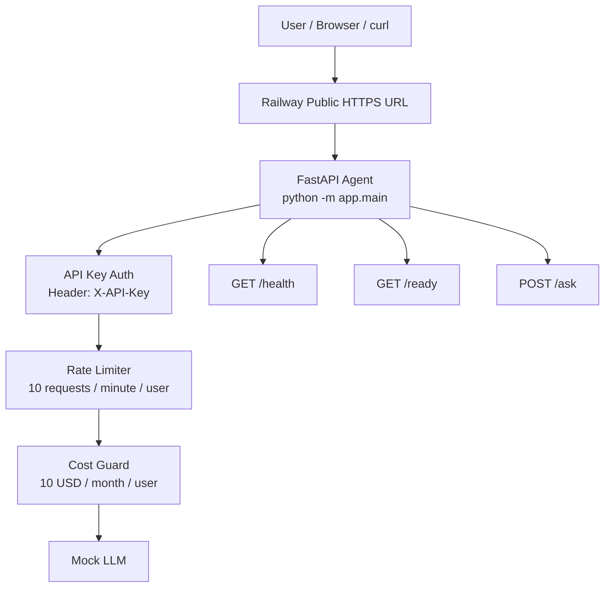
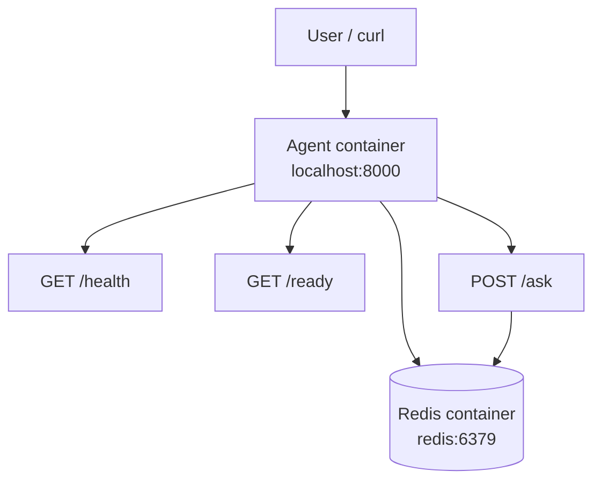
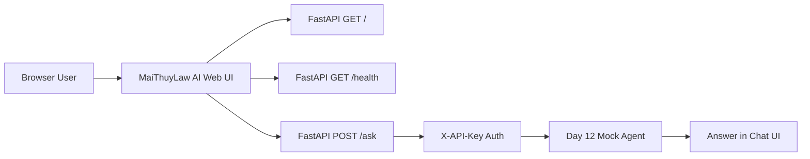

# Deployment Report

## Platform

Final production-ready AI agent đã được deploy lên **Railway**.

Public URL:

```text
https://day12-agent-railway-production.up.railway.app
```

Railway project information:

| Field | Value |
|---|---|
| Workspace | `Thái Nhi's Projects` |
| Project | `trustworthy-gratitude` |
| Environment | `production` |
| Service | `day12-agent-railway` |
| Region | `sfo` |
| Public URL | `https://day12-agent-railway-production.up.railway.app` |

Kết quả deploy:

- Railway build thành công.
- Container start thành công.
- Health check trên `/health` succeeded.
- Public URL truy cập được qua HTTPS.
- Final app chạy bằng root `Dockerfile`.
- Start command trên Railway là `python -m app.main`.

---

## Application

App được deploy là final root-level Day 12 production agent.

Main files:

- `app/main.py`
- `app/config.py`
- `app/auth.py`
- `app/rate_limiter.py`
- `app/cost_guard.py`
- `Dockerfile`
- `docker-compose.yml`
- `requirements.txt`
- `railway.toml`
- `.env.example`

Final root `Dockerfile` dùng multi-stage build với base image:

```dockerfile
ARG PYTHON_IMAGE=python:3.12-slim-bookworm
```

Lý do dùng `python:3.12-slim-bookworm`:

- Dùng Python runtime mới hơn.
- Image gọn hơn so với full Python image.
- Giảm security warnings từ Docker Scout / Docker DX.
- Phù hợp hơn cho production container.

---

## Deployment Architecture

Railway deployment architecture:



Local Docker Compose architecture:



Ghi chú:

- Trên Railway, app hiện chạy với `in-memory fallback` vì chưa gắn cloud Redis service.
- Ở local Docker Compose, app đã chạy với Redis thành công và `/health` trả về `storage: redis`.
- Điều này chứng minh app hỗ trợ Redis-backed state khi Redis available.

---

## Environment Variables

Required environment variables:

| Variable | Purpose |
|---|---|
| `AGENT_API_KEY` | API key dùng để bảo vệ protected endpoints như `/ask` |
| `ENVIRONMENT` | Xác định môi trường chạy app, ví dụ `production` |
| `RATE_LIMIT_PER_MINUTE` | Giới hạn số requests mỗi phút cho mỗi user |
| `MONTHLY_BUDGET_USD` | Monthly budget guard cho mỗi user |
| `PORT` | Port do Railway inject khi deploy |

Railway values used for testing:

```text
AGENT_API_KEY=local-dev-key
ENVIRONMENT=production
RATE_LIMIT_PER_MINUTE=10
MONTHLY_BUDGET_USD=10.0
```

Lưu ý bảo mật:

- `local-dev-key` chỉ dùng cho lab/testing.
- Khi dùng production thật, cần rotate `AGENT_API_KEY` sang secret mạnh hơn.
- `.env` không được commit lên GitHub.
- Repository chỉ commit `.env.example` để mô tả các biến môi trường cần thiết.

---

## Health Check

Command:

```bash
curl -i https://day12-agent-railway-production.up.railway.app/health
```

Observed result:

- `HTTP 200 OK`
- `status: ok`
- `environment: production`
- `version: 1.0.0`
- Railway headers xuất hiện trong response.

Ý nghĩa:

- App process đang chạy.
- Railway có thể gọi `/health` để kiểm tra service.
- Health check succeeded trong quá trình deploy.

Screenshot evidence:

- [Public health endpoint returns 200 OK](screenshots/02-public-health.png)

---

## Readiness Check

Command:

```bash
curl https://day12-agent-railway-production.up.railway.app/ready
```

Observed result:

- `HTTP 200 OK`
- `ready: true`
- Có `instance_id`
- Có `in_flight_requests`

Ý nghĩa:

- App đã startup xong.
- Instance sẵn sàng nhận traffic.
- Endpoint `/ready` có thể được dùng cho readiness probe.

---

## Authentication Test

### Test 1 — Missing API Key

Command:

```bash
curl -i -X POST https://day12-agent-railway-production.up.railway.app/ask \
  -H "Content-Type: application/json" \
  -d '{"question":"No auth public test"}'
```

Observed result:

- `HTTP 401 Unauthorized`
- Response có message: `Missing API key`
- App reject request vì thiếu header `X-API-Key`.

Screenshot evidence:

- [Public ask endpoint rejects missing API key with 401](screenshots/03-public-auth.png)

### Test 2 — Valid API Key

Command:

```bash
curl -i -X POST https://day12-agent-railway-production.up.railway.app/ask \
  -H "X-API-Key: local-dev-key" \
  -H "X-User-ID: railway-user" \
  -H "Content-Type: application/json" \
  -d '{"question":"Hello final Railway app","user_id":"railway-user"}'
```

Observed result:

- `HTTP 200 OK`
- `user_id: railway-user`
- Có `answer`
- Có `history_count`
- Có `rate_limit`
- Có `budget`

Ý nghĩa:

- API Key authentication hoạt động đúng.
- Protected endpoint `/ask` chỉ cho phép request hợp lệ.
- App trả về metadata cần thiết để quan sát rate limit và budget usage.

Screenshot evidence:

- [Public ask endpoint succeeds with API key](screenshots/04-public-ask-success.png)

---

## Docker Compose Local Test

Command:

```bash
docker compose up -d --build
```

Observed result:

- `agent` container healthy.
- `redis` container healthy.
- App expose tại `localhost:8000`.

Docker health command:

```bash
curl http://localhost:8000/health
```

Observed result:

- `HTTP 200 OK`
- `status: ok`
- `storage: redis`
- `redis_connected: true`

Ý nghĩa:

- Docker Compose stack chạy thành công.
- App kết nối được Redis trong internal Docker network.
- Conversation history có thể dùng Redis-backed storage khi Redis available.

Screenshot evidence:

- [Docker Compose runs agent and Redis as healthy services](screenshots/05-docker-compose-redis.png)

---

## Rate Limit Test

Local Docker test command:

```bash
for i in {1..12}; do
  echo "Request $i"
  curl -s -w "\nHTTP %{http_code}\n" -X POST http://localhost:8000/ask \
    -H "X-API-Key: local-dev-key" \
    -H "X-User-ID: screenshot-rate-user" \
    -H "Content-Type: application/json" \
    -d "{\"question\":\"Rate limit screenshot $i\",\"user_id\":\"screenshot-rate-user\"}"
  echo "-----"
done
```

Observed result:

- Requests 1 đến 10 trả về `HTTP 200`.
- Request 11 trả về `HTTP 429`.
- Request 12 cũng trả về `HTTP 429`.
- Error response có `Rate limit exceeded`.
- Limit được xác nhận là `10 requests / 60 seconds`.

Ý nghĩa:

- Rate limiting hoạt động đúng.
- App bảo vệ public API khỏi request spam.
- Mỗi user bị giới hạn theo `X-User-ID` hoặc `user_id`.

Screenshot evidence:

- [Rate limit returns 429 after 10 requests](screenshots/06-rate-limit-429.png)

---

## Screenshots

Các screenshots evidence được lưu trong thư mục `screenshots/`.

| # | Screenshot | Nội dung chứng minh |
|---:|---|---|
| 1 | [Railway deployment successful](screenshots/01-railway-deploy-success.png) | Railway service online, deployment successful, public URL hiển thị |
| 2 | [Public health endpoint returns 200 OK](screenshots/02-public-health.png) | Public `/health` trả về `HTTP 200 OK` |
| 3 | [Public ask endpoint rejects missing API key with 401](screenshots/03-public-auth.png) | `/ask` không có API key bị reject với `401 Unauthorized` |
| 4 | [Public ask endpoint succeeds with API key](screenshots/04-public-ask-success.png) | `/ask` có `X-API-Key` trả về `HTTP 200 OK` |
| 5 | [Docker Compose runs agent and Redis as healthy services](screenshots/05-docker-compose-redis.png) | Local Docker Compose có `agent` và `redis` healthy, `/health` trả về `storage: redis` |
| 6 | [Rate limit returns 429 after 10 requests](screenshots/06-rate-limit-429.png) | Request 11 và 12 bị reject với `HTTP 429` |

---

## Final Deployment Summary

Final deployment đã đạt các yêu cầu chính:

- Public HTTPS URL trên Railway.
- `/health` endpoint hoạt động.
- `/ready` endpoint hoạt động.
- `/ask` được bảo vệ bằng API Key authentication.
- Rate limiting hoạt động đúng.
- Cost guard trả về budget metadata trong response.
- Docker Compose local chạy được với Redis.
- Root `Dockerfile` dùng multi-stage build.
- Final base image đã cập nhật sang `python:3.12-slim-bookworm`.
- Screenshots evidence đã được lưu và link trong file này.

Kết luận: final production-ready AI agent đã được deploy thành công lên Railway, có public URL để test, có Docker Compose local stack với Redis, có authentication, rate limiting, health checks và deployment evidence đầy đủ.

<!-- MAITHUYLAW_UI_DEPLOYMENT_UPDATE_START -->

## Deployment Update: Public Web UI

The Railway deployment was updated to serve a simple web UI at the public root URL:

```text
https://day12-agent-railway-production.up.railway.app
```

Before this update, the root path returned raw JSON metadata. After the update, the root path serves the **MaiThuyLaw AI** web interface.

### Updated behavior

```text
GET /
→ MaiThuyLaw AI web chat UI

GET /health
→ backend health JSON

POST /ask
→ authenticated mock-agent response using X-API-Key
```

### Deployment method

The Railway service is deployed through Railway CLI:

```text
railway link
railway up
```

Linked target:

```text
Project: trustworthy-gratitude
Environment: production
Service: day12-agent-railway
```

### New evidence screenshots

```text
07-public-ui-home.png
- Public Railway URL rendering the MaiThuyLaw AI web UI.

08-public-ui-health.png
- UI health check successfully calling GET /health.

09-public-ui-auth-success.png
- UI authenticated request successfully calling POST /ask with X-API-Key.
```

### Current architecture after UI update



This update improves the public demo experience while preserving the original Day 12 production endpoints, API-key authentication, rate limiting, health checks, and Railway deployment workflow.

<!-- MAITHUYLAW_UI_DEPLOYMENT_UPDATE_END -->
