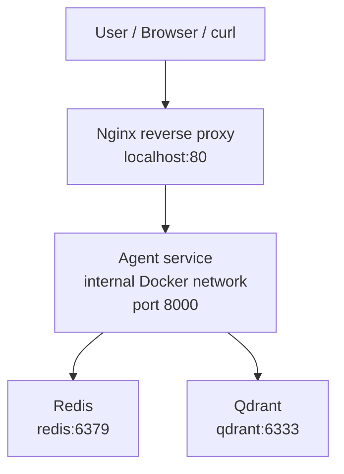
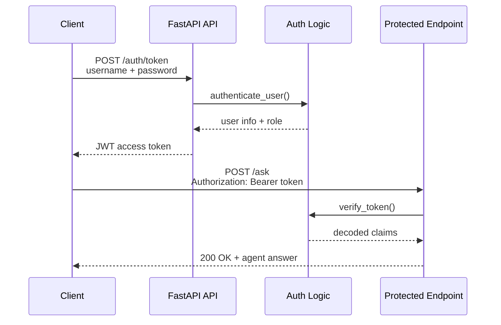
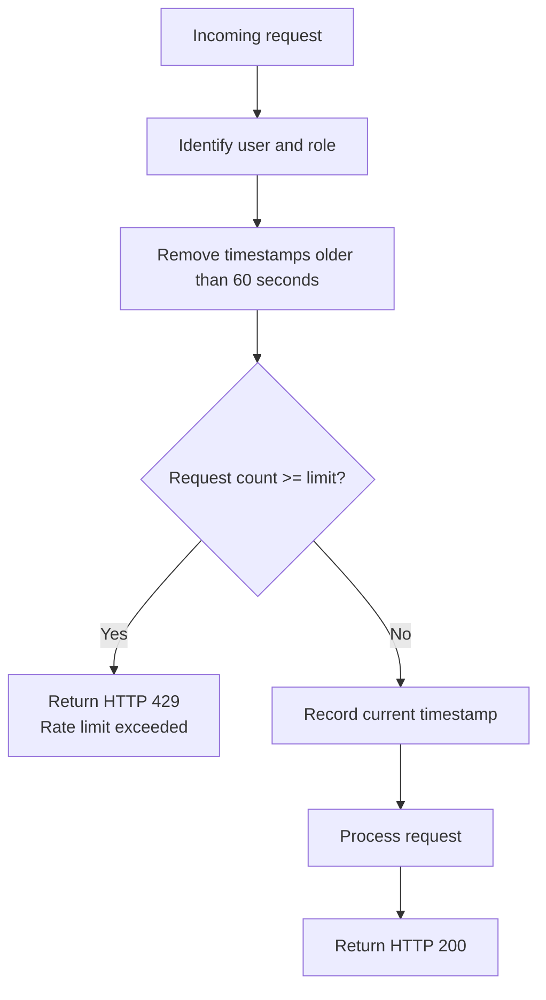
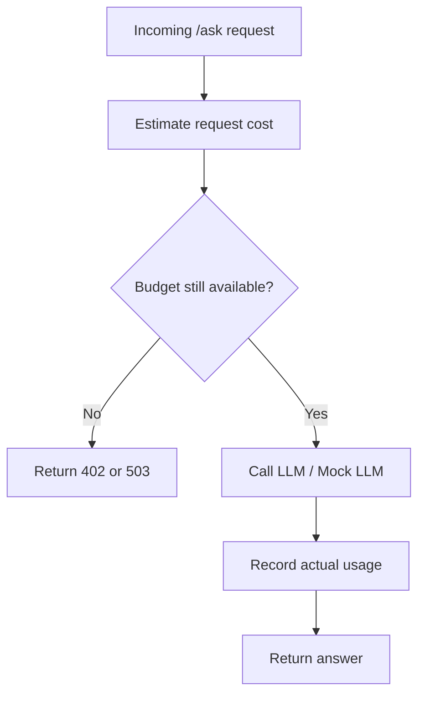
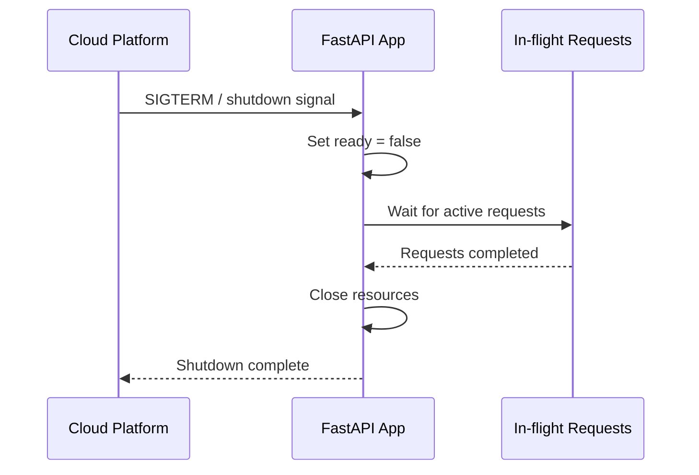
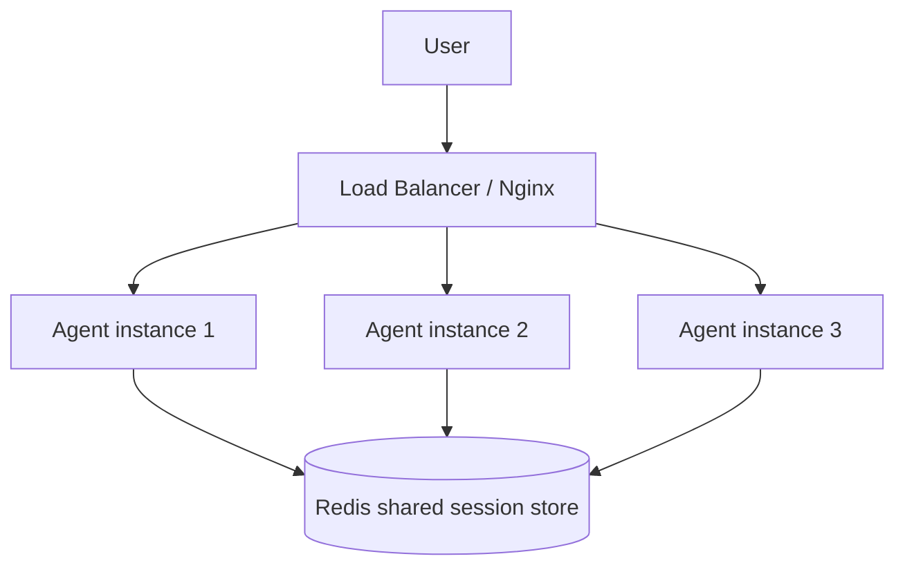
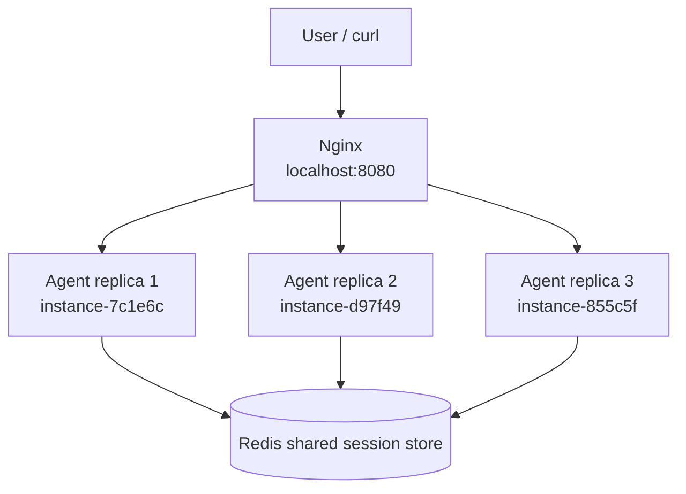
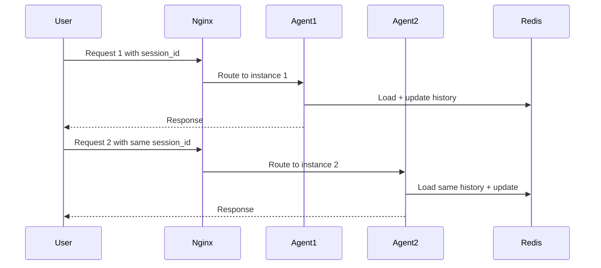

# Day 12 Lab - Mission Answers

## Part 1: Localhost vs Production

### Exercise 1.1 — Anti-patterns found in basic app

Trong phiên bản basic app, em tìm thấy các anti-patterns sau:

1. Hardcoded `OPENAI_API_KEY` trực tiếp trong source code.
   - Rủi ro: secret có thể bị lộ nếu push lên GitHub hoặc chia sẻ repository.

2. Hardcoded `DATABASE_URL` kèm username và password.
   - Rủi ro: database credentials bị lộ, đồng thời rất khó thay đổi giữa các môi trường như development, staging và production.

3. Các config như `DEBUG` và `MAX_TOKENS` bị hardcoded.
   - Rủi ro: app không thể cấu hình linh hoạt theo từng môi trường triển khai.

4. Dùng `print()` để logging và còn log cả API key.
   - Rủi ro: log không có cấu trúc, khó search/debug, và có thể làm lộ secrets.

5. Không có `/health` endpoint.
   - Rủi ro: cloud platform không biết service còn sống hay đã lỗi, nên không thể health check hoặc restart tự động.

6. App bind vào `localhost`.
   - Rủi ro: khi chạy trong container hoặc cloud environment, app có thể không nhận được external traffic.

7. Hardcoded port `8000`.
   - Rủi ro: các platform như Railway hoặc Render thường inject biến môi trường `PORT`, nên hardcoded port có thể làm deploy fail.

8. Bật `reload=True`.
   - Rủi ro: auto-reload chỉ phù hợp cho development, không nên dùng trong production vì tốn tài nguyên và không ổn định.

Kết luận: basic app chạy được ở local, nhưng chưa đạt chuẩn production-ready vì thiếu environment config, secret management, health check, structured logging và cloud-compatible host/port.

---

### Exercise 1.2 — Basic version run result

Em đã chạy thành công phiên bản basic localhost tại thư mục:

`01-localhost-vs-production/develop`

Commands đã dùng:

```bash
curl http://localhost:8000/
curl -X POST "http://localhost:8000/ask?question=Hello"
```

Kết quả quan sát được:

- `GET /` trả về `200 OK` với message: `Hello! Agent is running on my machine :)`
- `POST /ask?question=Hello` trả về `200 OK` với câu trả lời từ agent.
- Server log cho thấy request được xử lý thành công.
- Server cũng in ra hardcoded API key trong logs, xác nhận đây là một anti-pattern nguy hiểm.

Kết luận: basic version hoạt động tốt ở local, nhưng chưa an toàn và chưa phù hợp để deploy lên production.

---

### Exercise 1.3 — Localhost vs Production comparison

| Area | Basic localhost version | Production version | Vì sao quan trọng |
|---|---|---|---|
| Configuration | Config bị hardcoded trong source code. | Config được đọc từ environment variables trong `config.py`. | Cloud deployment cần thay đổi config giữa dev/staging/production mà không sửa code. |
| Secrets | API key và database URL bị hardcoded. | Secrets được đọc từ environment variables và không bị log ra ngoài. | Hardcoded secrets dễ bị leak qua GitHub hoặc logs. |
| Host binding | App bind vào `localhost`. | App bind vào `0.0.0.0`. | Container và cloud platform cần app nhận traffic từ bên ngoài container. |
| Port | Port `8000` bị hardcoded. | Port được đọc từ biến môi trường `PORT`. | Railway/Render inject port động khi deploy. |
| Logging | Dùng `print()` và log cả sensitive values. | Dùng structured JSON logging và không log secrets. | Production logs cần dễ search, dễ parse và an toàn. |
| Health checks | Không có `/health`. | Có `/health`, `/ready`, và `/metrics`. | Cloud platform dùng health check để restart hoặc route traffic. |
| Reload mode | Bật `reload=True`. | Chỉ bật reload khi `DEBUG=true`. | Auto-reload phù hợp cho dev, không phù hợp production. |
| Shutdown | Không có graceful shutdown. | Có lifespan hooks và signal handling. | Cloud platform có thể stop/replace containers, nên app cần xử lý shutdown sạch. |

Production test results:

- `GET /` trả về metadata của app và `status: running`.
- `GET /health` trả về `status: ok`.
- `GET /ready` trả về `ready: true`.
- `POST /ask` trả về mock agent answer.
- Server chạy trên `0.0.0.0:8000`, phù hợp với container/cloud deployment.

Kết luận: production version tuân theo 12-factor principles tốt hơn nhiều so với basic localhost version.

---

## Part 2: Docker

### Exercise 2.1 — Basic Dockerfile

#### 1. Base image là gì?

Trong basic Dockerfile của Part 2, base image là `python:3.11`.

Điều này có nghĩa là container bắt đầu từ một official Python 3.11 image, trong đó đã có sẵn Python runtime và các system dependencies cơ bản.

Đây là image được bài lab dùng ở giai đoạn Docker cơ bản. Sau đó, ở Final Project, root `Dockerfile` đã được cập nhật sang `python:3.12-slim-bookworm` để dùng Python runtime mới hơn và giảm security warnings từ Docker Scout / Docker DX.

#### 2. Working directory là gì?

Working directory là `/app`.

Dòng này:

```dockerfile
WORKDIR /app
```

có nghĩa là các lệnh tiếp theo như `COPY`, `RUN`, và `CMD` sẽ được thực thi trong thư mục `/app` bên trong container.

#### 3. Tại sao `COPY requirements.txt` trước?

`requirements.txt` được copy trước application code để tận dụng Docker layer caching.

Dependencies thường ít thay đổi hơn source code. Nếu chỉ sửa `app.py`, Docker có thể reuse cached layer của bước `pip install`, giúp rebuild nhanh hơn.

#### 4. `CMD` và `ENTRYPOINT` khác nhau thế nào?

`CMD` định nghĩa default command khi container start. Command này dễ override khi chạy `docker run`.

`ENTRYPOINT` định nghĩa executable chính của container. Arguments truyền vào `docker run` thường được append vào entrypoint.

Trong lab này, dùng:

```dockerfile
CMD ["python", "app.py"]
```

là đủ vì container chỉ cần start FastAPI app.

---

### Exercise 2.2 — Build and run develop Docker image

Build command:

```bash
docker build -f 02-docker/develop/Dockerfile -t my-agent:develop .
```

Image size observed:

| Metric | Value |
|---|---:|
| Disk usage | 1.66GB |
| Content size | 424MB |

Run command:

```bash
docker run -d --name my-agent-develop -p 8000:8000 my-agent:develop
```

Test results:

- `GET /health` trả về `status: ok` và `container: true`.
- `POST /ask?question=What%20is%20Docker%3F` trả về mock agent answer.
- Gửi JSON body tới `/ask` trả về validation error vì develop version nhận `question` qua query parameter.

Kết luận: develop Docker image build và run thành công, nhưng vẫn còn basic và chưa hoàn toàn production-ready.

---

### Exercise 2.3 — Multi-stage build

Multi-stage build gồm 2 stage chính: `builder` và `runtime`.

Ở phần Docker advanced ban đầu của lab, image được build theo hướng multi-stage để giảm kích thước và tách riêng build dependencies khỏi runtime environment. Sau đó, ở Final Project, root `Dockerfile` đã được cập nhật sang base image mới hơn là:

```dockerfile
ARG PYTHON_IMAGE=python:3.12-slim-bookworm
```

Việc dùng `ARG PYTHON_IMAGE` giúp cả `builder` stage và `runtime` stage dùng chung một base image, đồng thời dễ thay đổi Python version trong tương lai.

#### Stage 1: Builder

Final root `Dockerfile` dùng:

```dockerfile
FROM ${PYTHON_IMAGE} AS builder
```

Với giá trị mặc định:

```dockerfile
python:3.12-slim-bookworm
```

Nhiệm vụ của `builder` stage:

- Copy `requirements.txt`.
- Cài Python dependencies bằng `pip install --no-cache-dir --user -r requirements.txt`.
- Lưu installed packages vào `/root/.local`.
- Chỉ phục vụ quá trình build image, không phải final runtime container.

#### Stage 2: Runtime

Final root `Dockerfile` dùng:

```dockerfile
FROM ${PYTHON_IMAGE} AS runtime
```

Với cùng base image:

```dockerfile
python:3.12-slim-bookworm
```

Nhiệm vụ của `runtime` stage:

- Copy installed Python packages từ `builder` stage.
- Copy application source code gồm `app/` và `utils/`.
- Tạo non-root user `appuser`.
- Chạy app bằng command:

```dockerfile
CMD ["python", "-m", "app.main"]
```

Stage này chỉ chứa những gì cần thiết để chạy app ở runtime, giúp image gọn và an toàn hơn.

#### Vì sao image nhỏ hơn?

Multi-stage build giúp final image nhỏ hơn vì `runtime` stage không chứa:

- build cache
- temporary files
- tooling không cần thiết sau khi build
- source/dependency artifacts chỉ phục vụ build time

Image size comparison trong phần lab:

| Image | Disk usage | Content size |
|---|---:|---:|
| `my-agent:develop` | 1.66GB | 424MB |
| `my-agent:advanced` | 236MB | 56.6MB |

Sau khi hoàn thiện Final Project, root `Dockerfile` còn được cập nhật từ Python 3.11-based image sang `python:3.12-slim-bookworm` để dùng runtime mới hơn và giảm security warnings từ Docker Scout / Docker DX.

Kết luận: multi-stage build giúp image nhỏ hơn, sạch hơn và an toàn hơn single-stage image. Final Project dùng `python:3.12-slim-bookworm` cho cả `builder` và `runtime` stage.

---

### Exercise 2.4 — Docker Compose stack

Docker Compose stack gồm các services chính:

- `agent`: FastAPI AI agent service.
- `redis`: cache cho session, rate limiting và shared state.
- `qdrant`: vector database cho RAG-style retrieval.
- `nginx`: reverse proxy và load balancer, expose traffic ra host qua port 80 và 443.

Architecture diagram:



Cách các services giao tiếp:

- User gửi request tới Nginx thông qua `localhost:80`.
- Nginx proxy request tới `agent` bằng Docker service name `agent:8000`.
- Agent kết nối Redis bằng `redis://redis:6379/0`.
- Agent kết nối Qdrant bằng `http://qdrant:6333`.
- Redis và Qdrant không expose trực tiếp ra host, mà chỉ giao tiếp trong internal Docker network.

Test results:

- `docker compose ps` hiển thị `agent`, `redis`, và `qdrant` healthy.
- `GET http://localhost/health` trả về `status: ok`.
- `POST http://localhost/ask` trả về mock agent answer.
- Nginx route request thành công từ `localhost:80` tới internal agent service.

Kết luận: Docker Compose stack chạy thành công một production-like multi-service architecture gồm reverse proxy, cache, vector database và internal networking.

---

## Part 3: Cloud Deployment

### Exercise 3.1 — Deploy Railway

Railway project information:

| Field | Value |
|---|---|
| Project name | `trustworthy-gratitude` |
| Service name | `day12-agent-railway` |
| Public URL | `https://day12-agent-railway-production.up.railway.app` |
| Environment | `production` |

Deployment result:

- Railway deployment completed successfully.
- Railway health check trên `/health` succeeded.
- Service start thành công với Railway-provided `PORT`.
- App listen trên `0.0.0.0`, đúng yêu cầu cho cloud deployment.
- Environment variables đã được set trên Railway cho `PORT`, `ENVIRONMENT`, và `AGENT_API_KEY`.

Public URL test commands:

```bash
curl https://day12-agent-railway-production.up.railway.app/health

curl -X POST https://day12-agent-railway-production.up.railway.app/ask \
  -H "Content-Type: application/json" \
  -d '{"question":"Hello from public Railway URL"}'
```

Observed results:

- `GET /health` trả về `status: ok`, `platform: Railway`, và timestamp.
- `POST /ask` trả về question, agent answer, và `platform: Railway`.

Kết luận: agent đã deploy thành công lên Railway và có thể truy cập qua public HTTPS URL.

---

### Exercise 3.2 — Render vs Railway configuration

Railway dùng `railway.toml`, trong khi Render dùng `render.yaml`.

Key differences:

| Area | Railway `railway.toml` | Render `render.yaml` |
|---|---|---|
| Build system | Dùng `builder = "NIXPACKS"` để auto-detect Python app. | Dùng explicit `runtime: python` và `buildCommand: pip install -r requirements.txt`. |
| Start command | Dùng `startCommand = "uvicorn app:app --host 0.0.0.0 --port $PORT"`. | Cũng dùng `startCommand: uvicorn app:app --host 0.0.0.0 --port $PORT`. |
| Health check | Có `healthcheckPath = "/health"` và `healthcheckTimeout = 30`. | Có `healthCheckPath: /health`. |
| Infrastructure definition | Tập trung vào build/deploy behavior cho một service. | Mô tả infrastructure rõ hơn, gồm web service, Redis service, region, plan và env vars. |
| Environment variables | Set bằng Railway Dashboard hoặc Railway CLI. | Có thể định nghĩa trong `render.yaml`; secrets có thể set ở Dashboard. |
| Extra services | Railway example chỉ deploy web agent service. | Render blueprint có thêm Redis service `agent-cache`. |
| Auto deploy | Có thể deploy bằng CLI với `railway up`. | Có `autoDeploy: true`, tự redeploy khi push code lên GitHub. |
| Region/plan | Không bắt buộc khai báo trong `railway.toml`. | Khai báo rõ `region: singapore` và `plan: free`. |

Similarities:

- Cả hai đều inject biến môi trường `PORT`.
- Cả hai đều yêu cầu app bind vào `0.0.0.0`.
- Cả hai đều dùng `/health` làm health check endpoint.
- Cả hai đều hỗ trợ quản lý secrets ngoài source code.
- Cả hai đều phù hợp để deploy FastAPI agent ra public URL.

Kết luận: Railway đơn giản hơn cho quick CLI-based deployment và prototype. Render rõ ràng hơn theo hướng infrastructure-as-code vì `render.yaml` có thể mô tả web service, Redis service, region, plan, env vars, health checks và auto-deploy trong một file.

---

## Part 4: API Security

### Exercise 4.1 — API Key authentication

API key được kiểm tra ở đâu?

API key được kiểm tra trong dependency `verify_api_key()` tại:

`04-api-gateway/develop/app.py`

App đọc expected key từ environment variable:

```text
AGENT_API_KEY
```

Header được dùng:

```text
X-API-Key
```

Expected value trong test:

```text
secret-key-123
```

Kết quả khi key bị thiếu hoặc sai:

- Missing API key trả về `401 Unauthorized`.
- Wrong API key trả về `403 Forbidden`.
- Correct API key trả về `200 OK` và agent answer.

Test results:

- Request không có `X-API-Key` trả về: `Missing API key. Include header: X-API-Key: <your-key>`.
- Request với `X-API-Key: wrong-key` trả về: `Invalid API key`.
- Request với `X-API-Key: secret-key-123` trả về successful mock agent response.

Cách rotate key:

Để rotate API key, chỉ cần update environment variable `AGENT_API_KEY` trên deployment platform hoặc local shell, sau đó restart/redeploy service. Không cần sửa source code.

Kết luận: API Key authentication bảo vệ `/ask` endpoint, trong khi `/health` vẫn public để platform health check.

---

### Exercise 4.2 — JWT authentication

JWT flow:



JWT process:

1. Client gửi username và password tới `POST /auth/token`.
2. Server verify credentials bằng `authenticate_user()`.
3. Nếu credentials hợp lệ, server tạo JWT bằng `create_token()`.
4. JWT chứa `sub`, `role`, `iat`, và `exp`.
5. Client gửi token ở các request sau bằng header `Authorization: Bearer <token>`.
6. Protected endpoints dùng `verify_token()` để decode và validate JWT.
7. Nếu token thiếu, expired hoặc invalid, server reject request.

Demo users:

| Username | Password | Role |
|---|---|---|
| `student` | `demo123` | `user` |
| `teacher` | `teach456` | `admin` |

JWT test result:

- `POST /auth/token` với `student / demo123` trả về JWT access token.
- `POST /ask` với `Authorization: Bearer <token>` trả về `200 OK`.
- Response có question, mock answer, rate-limit remaining count và budget usage.

Kết luận: JWT authentication là stateless vì server có thể verify signed token mà không cần lưu session cho từng request.

---

### Exercise 4.3 — Rate limiting

Algorithm used:

App dùng `Sliding Window Counter`.

Cách hoạt động:

- Mỗi user có một deque lưu timestamps của requests.
- Với mỗi request mới, app xóa timestamps cũ nằm ngoài 60-second window.
- Nếu số timestamps đã đạt limit, request bị reject với `429 Too Many Requests`.
- Nếu chưa đạt limit, timestamp hiện tại được lưu lại và request được cho phép.

Limits:

| User type | Limit |
|---|---:|
| Normal user | 10 requests / 60 seconds |
| Admin user | 100 requests / 60 seconds |

Admin có limit cao hơn như thế nào?

App đọc role từ JWT. Nếu `role == "admin"`, app dùng `rate_limiter_admin`. Ngược lại, app dùng `rate_limiter_user`.

Rate limiting flow:



Rate limit test result:

- Requests 1 đến 10 trả về `HTTP 200`.
- Request 11 trả về `HTTP 429`.
- Request 12 cũng trả về `HTTP 429`.
- Error response có `Rate limit exceeded`, `limit: 10`, `window_seconds: 60`, và `retry_after_seconds`.

Kết luận: rate limiting giúp bảo vệ public API khỏi abuse và tránh việc một user tiêu thụ quá nhiều tài nguyên.

---

### Exercise 4.4 — Cost guard

Cost guard hiện tại làm gì?

App dùng `CostGuard` để bảo vệ LLM budget.

Cơ chế chính:

- `check_budget(user_id)` chạy trước khi gọi LLM.
- `record_usage(user_id, input_tokens, output_tokens)` chạy sau khi có LLM response.
- App track input tokens, output tokens, request count và estimated cost.
- Có per-user daily budget `$1.00`.
- Có global daily budget `$10.00`.
- Nếu user vượt budget, app trả về `402 Payment Required`.
- Nếu global budget bị vượt, app trả về `503 Service Unavailable`.

Vì sao Redis tốt hơn cho production?

Implementation hiện tại lưu usage trong memory. Điều này ổn cho demo, nhưng không phù hợp production vì mỗi container có memory riêng. Nếu scale nhiều replicas, mỗi replica sẽ có budget counter khác nhau.

Production design nên lưu budget usage trong Redis để tất cả replicas dùng chung một budget state.

Redis-based implementation idea:

```python
import os
import redis
from datetime import datetime

r = redis.Redis.from_url(os.getenv("REDIS_URL", "redis://localhost:6379/0"))

def check_budget(user_id: str, estimated_cost: float) -> bool:
    month_key = datetime.now().strftime("%Y-%m")
    key = f"budget:{user_id}:{month_key}"

    current = float(r.get(key) or 0)

    if current + estimated_cost > 10:
        return False

    pipe = r.pipeline()
    pipe.incrbyfloat(key, estimated_cost)
    pipe.expire(key, 32 * 24 * 3600)
    pipe.execute()

    return True
```

Cost guard flow:



Kết luận: cost guard giúp tránh phát sinh chi phí LLM ngoài kiểm soát bằng cách check estimated cost trước khi xử lý request và track usage trong shared storage như Redis.

---

## Part 5: Scaling & Reliability

### Exercise 5.1 — Health checks

App triển khai hai health-related endpoints:

| Endpoint | Loại probe | Ý nghĩa |
|---|---|---|
| `/health` | Liveness probe | Process còn sống hay không |
| `/ready` | Readiness probe | Instance đã sẵn sàng nhận traffic chưa |

`/health` trả lời câu hỏi: “Process có còn sống không?”

Endpoint này trả về:

- overall status
- uptime
- version
- environment
- timestamp
- dependency checks như memory usage

`/ready` trả lời câu hỏi: “Instance này có sẵn sàng nhận traffic không?”

Endpoint này trả về `ready: true` khi app startup xong và có thể serve requests. Nếu app đang startup hoặc shutting down, endpoint có thể trả về `503`.

Test results:

- `GET /health` trả về `status: ok`.
- `GET /health` cũng hiển thị memory check status là `ok`.
- `GET /ready` trả về `ready: true`.
- `POST /ask?question=Reliability%20test` trả về agent answer.

Kết luận: health checks và readiness checks giúp cloud platform hoặc load balancer quyết định khi nào cần restart container hoặc route traffic tới instance.

---

### Exercise 5.2 — Graceful shutdown

App dùng FastAPI lifespan hooks và signal handling cho graceful shutdown.

Cách hoạt động:

- Trong startup, app set `_is_ready = True`.
- Trong shutdown, app set `_is_ready = False`.
- App track active requests bằng `_in_flight_requests`.
- Khi shutdown, app đợi in-flight requests xử lý xong.
- `timeout_graceful_shutdown=30` cho app tối đa 30 giây để shutdown sạch.
- `SIGTERM` và `SIGINT` được log để quan sát shutdown behavior.

Graceful shutdown flow:



Observed shutdown logs:

- `Graceful shutdown initiated`
- `Shutdown complete`

Kết luận: graceful shutdown giúp tránh việc platform kill process trong lúc app vẫn đang xử lý request.

---

### Exercise 5.3 — Stateless design

Anti-pattern:

Lưu conversation history trong memory là không scalable. Nếu request 1 đi tới instance A và request 2 đi tới instance B, instance B sẽ không thấy history đang lưu trong memory của instance A.

Correct design:

Conversation history nên được lưu trong Redis.

Trong production scaling demo:

- `save_session()` lưu session data vào Redis.
- `load_session()` đọc session data từ Redis.
- `append_to_history()` thêm user và assistant messages vào shared session history.
- Bất kỳ agent instance nào cũng có thể tiếp tục cùng một conversation vì tất cả cùng đọc từ Redis.

Stateless design diagram:



Kết luận: app instances có thể stateless và scale horizontally vì shared state được đưa ra khỏi app process và lưu trong Redis.

---

### Exercise 5.4 — Load balancing

Production stack dùng:

- 3 `agent` instances
- 1 Redis container
- 1 Nginx load balancer

Architecture:



Docker Compose command used:

```bash
docker compose up -d --build --scale agent=3
```

Observed services:

- `production-agent-1` healthy
- `production-agent-2` healthy
- `production-agent-3` healthy
- `production-redis-1` healthy
- `production-nginx-1` running on `localhost:8080`

Load balancing test result:

Requests được phân phối qua ba instances:

- `instance-7c1e6c`
- `instance-d97f49`
- `instance-855c5f`

Mỗi response đều hiển thị:

```text
storage: redis
```

Kết luận: Nginx đã phân phối traffic thành công qua nhiều agent instances, trong khi session state vẫn được giữ nhất quán nhờ Redis.

---

### Exercise 5.5 — Test stateless

Script `test_stateless.py` được dùng để kiểm tra conversation history có được giữ nguyên khi request đi qua nhiều app instances hay không.

Observed result:

- 5 requests được gửi trong cùng một session.
- Requests được serve bởi 3 instances khác nhau.
- Conversation history vẫn có 10 messages.
- Script in ra: `Session history preserved across all instances via Redis`.

Stateless request flow:



Kết luận: app là stateless ở tầng agent containers. Session state được lưu trong Redis, nên bất kỳ replica nào cũng có thể xử lý request tiếp theo mà không làm mất conversation history.

---

## Part 6: Final Project

### Production-ready AI Agent

Em đã xây dựng final production-ready AI agent ở root của repository.

Root-level files đã tạo:

- `app/main.py`
- `app/config.py`
- `app/auth.py`
- `app/rate_limiter.py`
- `app/cost_guard.py`
- `app/__init__.py`
- `Dockerfile`
- `docker-compose.yml`
- `requirements.txt`
- `.env.example`
- `.dockerignore`
- `railway.toml`

Implemented features:

- REST API endpoint: `POST /ask`
- Conversation history
- Redis-backed session history khi Redis available
- API Key authentication với `X-API-Key`
- Optional user identity bằng `X-User-ID` hoặc `user_id` trong request body
- Rate limiting: 10 requests per minute per user
- Monthly cost guard: `$10/month` per user
- Health check endpoint: `GET /health`
- Readiness endpoint: `GET /ready`
- Structured JSON logging
- Dockerized app bằng multi-stage Dockerfile
- Docker Compose stack với Redis
- Railway config bằng root `railway.toml`
- Final root `Dockerfile` dùng base image `python:3.12-slim-bookworm` để giảm security warnings từ Docker Scout / Docker DX.

Final project architecture:

```mermaid
flowchart TD
    U[User / curl / Browser] --> API[FastAPI Agent<br/>POST /ask]

    API --> AUTH[API Key Auth<br/>X-API-Key]
    AUTH --> RL[Rate Limiter<br/>10 req/min/user]
    RL --> CG[Cost Guard<br/>10 USD/month/user]
    CG --> LLM[Mock LLM]
    LLM --> H[Conversation History]

    H --> R[(Redis if available)]
    H --> M[In-memory fallback]

    API --> HC[/health]
    API --> RD[/ready]
```

Local test results:

- `GET /health` trả về `200 OK`.
- `GET /ready` trả về `200 OK`.
- `POST /ask` không có API key trả về `401 Unauthorized`.
- `POST /ask` có `X-API-Key: local-dev-key` trả về `200 OK`.
- `/history` trả về saved conversation history.
- Docker Compose health check hiển thị cả `agent` và `redis` healthy.
- Trong Docker Compose, `/health` trả về `storage: redis` và `redis_connected: true`.

Rate limit test results:

- Requests 1 đến 10 trả về `HTTP 200`.
- Request 11 trả về `HTTP 429`.
- Request 12 cũng trả về `HTTP 429`.

Cloud deployment results:

- Final app đã deploy thành công lên Railway.
- Public URL: `https://day12-agent-railway-production.up.railway.app`
- Public `/health` trả về `200 OK`.
- Public `/ready` trả về `200 OK`.
- Public `/ask` không có API key trả về `401 Unauthorized`.
- Public `/ask` có `X-API-Key` trả về `200 OK`.

Evidence:

- Deployment details được ghi trong `DEPLOYMENT.md`.
- Screenshots được lưu trong thư mục `screenshots/`.

Kết luận:

Final project đã kết hợp các concept chính của Day 12: environment-based config, authentication, rate limiting, budget protection, Redis-backed state, health checks, Docker, Docker Compose và cloud deployment configuration. App đã chạy thành công ở local Docker Compose với Redis và đã deploy thành công lên Railway với public HTTPS URL.

<!-- MAITHUYLAW_UI_MISSION_UPDATE_START -->

## Final UI Update: MaiThuyLaw AI Public Interface

After completing the original Day 12 production deployment, I added a lightweight public web UI to make the deployed agent usable from a browser.

The public Railway URL now opens a branded **MaiThuyLaw AI** interface instead of raw API JSON:

```text
https://day12-agent-railway-production.up.railway.app
```

The UI provides:

```text
- API key input for X-API-Key authentication
- User ID input for X-User-ID
- Health check button calling GET /health
- Chat box calling POST /ask
- Browser-visible success and error states
```

Verified evidence:

```text
screenshots/07-public-ui-home.png
screenshots/08-public-ui-health.png
screenshots/09-public-ui-auth-success.png
```

This is still the Day 12 mock production agent, but it now has a user-facing interface suitable for demo and public deployment. The next upgrade path is to replace the mock agent with the real MaiThuyLaw legal/news RAG agent while keeping the same deployment structure.

<!-- MAITHUYLAW_UI_MISSION_UPDATE_END -->
