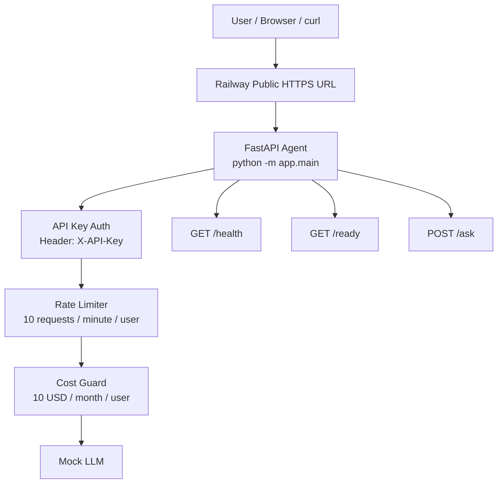
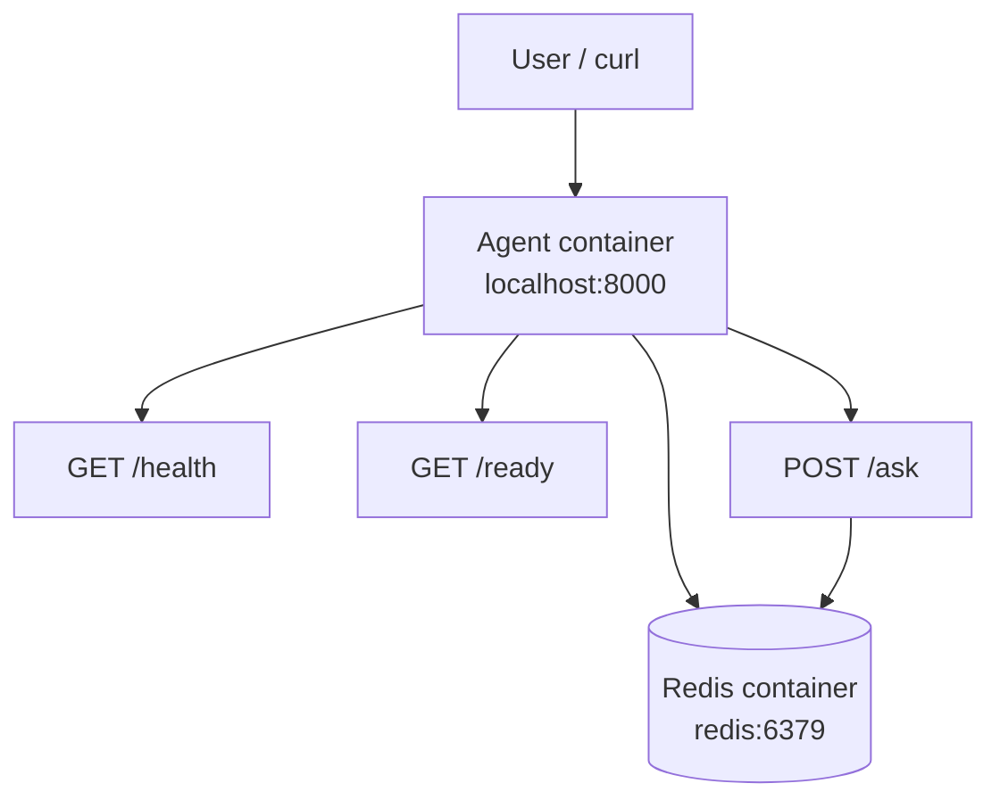

# Day 12 — Deployment: Đưa Agent Lên Cloud

> **Student Name:** Thái Thị Yến Nhi  
> **Student ID:** 2A202600783  
> **Date:** 12/06/2026 
> 
> Repository này bao gồm các phần học theo từng concept và một **Final Project** hoàn chỉnh ở root của repo.

---

## Tổng Quan

Mục tiêu của Day 12 là hiểu và thực hành toàn bộ quy trình đưa một AI Agent lên môi trường production:

- Chuyển từ `localhost` sang production-ready app.
- Đóng gói app bằng Docker.
- Deploy app lên cloud platform.
- Bảo vệ API bằng authentication.
- Thêm rate limiting và cost guard.
- Thiết kế stateless app để scale.
- Dùng Redis cho shared state.
- Viết deployment report và lưu screenshot evidence.

Final project đã được triển khai ở **root của repository**, không nằm trong folder nested.

Public Railway URL:

```text
https://day12-agent-railway-production.up.railway.app
```

---

## Cấu Trúc Repository

```text
day12_ha-tang-cloud_va_deployment/
├── app/                                # Final production-ready FastAPI agent ở root
│   ├── __init__.py
│   ├── auth.py                         # API Key authentication
│   ├── config.py                       # Environment-based configuration
│   ├── cost_guard.py                   # Monthly budget guard
│   ├── main.py                         # FastAPI app, endpoints, logging, history
│   └── rate_limiter.py                 # Rate limiting logic
│
├── utils/
│   └── mock_llm.py                     # Mock LLM dùng cho lab, không cần API key thật
│
├── screenshots/                        # Screenshot evidence cho deployment
│   ├── 01-railway-deploy-success.png
│   ├── 02-public-health.png
│   ├── 03-public-auth.png
│   ├── 04-public-ask-success.png
│   ├── 05-docker-compose-redis.png
│   └── 06-rate-limit-429.png
│
├── 01-localhost-vs-production/          # Part 1: Dev vs Production
│   ├── develop/                        # Basic localhost app
│   └── production/                     # Production-style app
│
├── 02-docker/                          # Part 2: Docker
│   ├── develop/                        # Basic Dockerfile
│   └── production/                     # Multi-stage Docker + Compose stack
│
├── 03-cloud-deployment/                # Part 3: Cloud Deployment
│   ├── railway/                        # Railway deployment example
│   ├── render/                         # Render deployment example
│   └── production-cloud-run/           # Cloud Run / CI-CD example
│
├── 04-api-gateway/                     # Part 4: API Security
│   ├── develop/                        # API Key authentication
│   └── production/                     # JWT, rate limiting, cost guard
│
├── 05-scaling-reliability/             # Part 5: Scaling & Reliability
│   ├── develop/                        # Health checks, graceful shutdown
│   └── production/                     # Stateless app, Redis, Nginx load balancing
│
├── 06-lab-complete/                    # Reference complete lab project
│
├── Dockerfile                          # Final root Dockerfile
├── docker-compose.yml                  # Final local stack: agent + Redis
├── requirements.txt                    # Final root dependencies
├── railway.toml                        # Railway deployment config
├── .env.example                        # Example environment variables
├── .dockerignore                       # Docker build ignore rules
├── MISSION_ANSWERS.md                  # Answers and results for Part 1 → Part 6
├── DEPLOYMENT.md                       # Deployment report with test evidence
├── DAY12_DELIVERY_CHECKLIST.md         # Lab delivery checklist
├── CODE_LAB.md                         # Detailed lab guide
├── QUICK_START.md                      # Quick start guide
├── QUICK_REFERENCE.md                  # Command reference
├── TROUBLESHOOTING.md                  # Common issues and fixes
└── INSTRUCTOR_GUIDE.md                 # Grading guide
```

---

## Final Project: Production AI Agent

Final project được implement ở root của repository.

Các file chính:

- `app/main.py`
- `app/config.py`
- `app/auth.py`
- `app/rate_limiter.py`
- `app/cost_guard.py`
- `Dockerfile`
- `docker-compose.yml`
- `requirements.txt`
- `.env.example`
- `railway.toml`
- `DEPLOYMENT.md`
- `MISSION_ANSWERS.md`
- `screenshots/`

---

## Final Project Features

Final app đã implement các production features sau:

| Feature | Mô tả |
|---|---|
| `POST /ask` | Endpoint chính để hỏi AI Agent |
| `GET /health` | Liveness health check |
| `GET /ready` | Readiness check |
| `GET /history` | Xem conversation history theo user |
| `GET /usage` | Xem budget usage theo user |
| API Key Authentication | Bảo vệ protected endpoints bằng `X-API-Key` |
| User identity | Hỗ trợ `X-User-ID` hoặc `user_id` trong request body |
| Rate limiting | Giới hạn `10 requests / minute / user` |
| Cost guard | Monthly budget guard `$10/month/user` |
| Conversation history | Lưu lịch sử hội thoại |
| Redis support | Dùng Redis khi available, fallback sang in-memory |
| Structured logging | Log dạng JSON để dễ quan sát |
| Dockerized app | Multi-stage Dockerfile |
| Docker Compose | Local stack gồm `agent` và `redis` |
| Railway deployment | Public HTTPS deployment URL |

---

## Architecture

### Railway Deployment



### Local Docker Compose



Ghi chú:

- Trên Railway, app chạy được public bằng HTTPS.
- Local Docker Compose chạy với Redis và `/health` trả về `storage: redis`.
- App hỗ trợ Redis-backed state khi Redis available.
- Nếu không có Redis, app fallback sang in-memory để vẫn chạy được.

---

## Dockerfile

Final root `Dockerfile` dùng multi-stage build.

Base image hiện tại:

```dockerfile
ARG PYTHON_IMAGE=python:3.12-slim-bookworm
```

Lý do cập nhật sang `python:3.12-slim-bookworm`:

- Dùng Python runtime mới hơn.
- Image gọn hơn full Python image.
- Giảm security warnings từ Docker Scout / Docker DX.
- Phù hợp hơn cho production container.
- Dễ thay đổi version về sau nhờ `ARG PYTHON_IMAGE`.

---

## Environment Variables

Các environment variables chính:

| Variable | Mục đích |
|---|---|
| `AGENT_API_KEY` | API key để bảo vệ protected endpoints |
| `ENVIRONMENT` | Môi trường chạy app, ví dụ `production` |
| `RATE_LIMIT_PER_MINUTE` | Số requests tối đa mỗi phút cho mỗi user |
| `MONTHLY_BUDGET_USD` | Budget guard theo tháng cho mỗi user |
| `REDIS_URL` | Redis connection string |
| `PORT` | Port do Railway inject khi deploy |
| `LOG_LEVEL` | Logging level |
| `LLM_MODEL` | Tên model/mock model |

File `.env.example` đã được commit để mô tả config cần thiết.

File `.env` thật không được commit lên GitHub.

---

## Chạy Local Bằng Docker Compose

Build và start local stack:

```bash
docker compose up -d --build
```

Kiểm tra containers:

```bash
docker compose ps
```

Test health endpoint:

```bash
curl http://localhost:8000/health
```

Kết quả mong đợi:

```json
{
  "status": "ok",
  "environment": "production",
  "storage": "redis",
  "redis_connected": true
}
```

Stop stack:

```bash
docker compose down
```

---

## Test API Local

### Health Check

```bash
curl http://localhost:8000/health
```

### Readiness Check

```bash
curl http://localhost:8000/ready
```

### Test Missing API Key

```bash
curl -i -X POST http://localhost:8000/ask \
  -H "Content-Type: application/json" \
  -d '{"question":"No auth test"}'
```

Expected result:

```text
HTTP 401 Unauthorized
```

### Test Valid API Key

```bash
curl -i -X POST http://localhost:8000/ask \
  -H "X-API-Key: local-dev-key" \
  -H "X-User-ID: student" \
  -H "Content-Type: application/json" \
  -d '{"question":"Hello agent","user_id":"student"}'
```

Expected result:

```text
HTTP 200 OK
```

### Test Conversation History

```bash
curl http://localhost:8000/history \
  -H "X-API-Key: local-dev-key" \
  -H "X-User-ID: student"
```

---

## Test Public Railway Deployment

Public URL:

```text
https://day12-agent-railway-production.up.railway.app
```

### Public Health Check

```bash
curl -i https://day12-agent-railway-production.up.railway.app/health
```

Expected result:

```text
HTTP 200 OK
```

### Public Readiness Check

```bash
curl https://day12-agent-railway-production.up.railway.app/ready
```

Expected result:

```text
ready: true
```

### Public Auth Failure Test

```bash
curl -i -X POST https://day12-agent-railway-production.up.railway.app/ask \
  -H "Content-Type: application/json" \
  -d '{"question":"No auth public test"}'
```

Expected result:

```text
HTTP 401 Unauthorized
```

### Public Auth Success Test

```bash
curl -i -X POST https://day12-agent-railway-production.up.railway.app/ask \
  -H "X-API-Key: local-dev-key" \
  -H "X-User-ID: railway-user" \
  -H "Content-Type: application/json" \
  -d '{"question":"Hello final Railway app","user_id":"railway-user"}'
```

Expected result:

```text
HTTP 200 OK
```

---

## Rate Limit Test

Local Docker test:

```bash
for i in {1..12}; do
  echo "Request $i"
  curl -s -w "\nHTTP %{http_code}\n" -X POST http://localhost:8000/ask \
    -H "X-API-Key: local-dev-key" \
    -H "X-User-ID: rate-test-user" \
    -H "Content-Type: application/json" \
    -d "{\"question\":\"Rate limit test $i\",\"user_id\":\"rate-test-user\"}"
  echo "-----"
done
```

Observed result:

- Requests 1 đến 10 trả về `HTTP 200`.
- Request 11 trả về `HTTP 429`.
- Request 12 cũng trả về `HTTP 429`.

Điều này xác nhận rate limit `10 requests / 60 seconds / user` hoạt động đúng.

---

## Deployment Evidence

Deployment report nằm ở:

```text
DEPLOYMENT.md
```

Mission answers nằm ở:

```text
MISSION_ANSWERS.md
```

Screenshots evidence nằm trong:

```text
screenshots/
```

Danh sách screenshots:

| # | File | Nội dung |
|---:|---|---|
| 1 | `screenshots/01-railway-deploy-success.png` | Railway deployment successful |
| 2 | `screenshots/02-public-health.png` | Public `/health` trả về `HTTP 200 OK` |
| 3 | `screenshots/03-public-auth.png` | Public `/ask` thiếu API key trả về `401 Unauthorized` |
| 4 | `screenshots/04-public-ask-success.png` | Public `/ask` có API key trả về `HTTP 200 OK` |
| 5 | `screenshots/05-docker-compose-redis.png` | Docker Compose có `agent` và `redis` healthy |
| 6 | `screenshots/06-rate-limit-429.png` | Rate limit trả về `HTTP 429` sau 10 requests |

---

## Lab Sections

| Part | Folder | Nội dung chính |
|---:|---|---|
| 1 | `01-localhost-vs-production` | Localhost vs production, 12-factor principles |
| 2 | `02-docker` | Dockerfile, image build, multi-stage build, Docker Compose |
| 3 | `03-cloud-deployment` | Railway, Render, Cloud Run |
| 4 | `04-api-gateway` | API Key, JWT, rate limiting, cost guard |
| 5 | `05-scaling-reliability` | Health checks, graceful shutdown, stateless app, Redis, load balancing |
| 6 | Root project + `06-lab-complete` | Final production-ready AI Agent |

---

## Lab Materials

| File | Mục đích |
|---|---|
| `CODE_LAB.md` | Hướng dẫn lab chi tiết |
| `QUICK_START.md` | Hướng dẫn chạy nhanh |
| `QUICK_REFERENCE.md` | Cheat sheet commands và patterns |
| `TROUBLESHOOTING.md` | Hướng dẫn xử lý lỗi thường gặp |
| `INSTRUCTOR_GUIDE.md` | Hướng dẫn chấm điểm |
| `DAY12_DELIVERY_CHECKLIST.md` | Checklist nộp bài |

---

## Submission Checklist

Repo này đã hoàn thành các yêu cầu chính:

- [x] `MISSION_ANSWERS.md` có câu trả lời Part 1 đến Part 6.
- [x] Source code final project nằm ở root.
- [x] Có root `app/`.
- [x] Có root `Dockerfile`.
- [x] Có root `docker-compose.yml`.
- [x] Có root `requirements.txt`.
- [x] Có `.env.example`.
- [x] Có `.dockerignore`.
- [x] Có `railway.toml`.
- [x] Có `DEPLOYMENT.md`.
- [x] Có folder `screenshots/`.
- [x] Có public Railway URL.
- [x] Public `/health` test thành công.
- [x] Public `/ask` authentication test thành công.
- [x] Local Docker Compose test với Redis thành công.
- [x] Rate limiting test trả về `HTTP 429` đúng.
- [x] Không commit `.env` thật.
- [x] GitHub repo đã được push.

---

## Kết Luận

Repository này hoàn thành Day 12 Lab về cloud deployment cho AI Agent.

Final project đã chứng minh được các yêu cầu production chính:

- Environment-based config
- Secret management bằng environment variables
- Docker multi-stage build
- Docker Compose local stack với Redis
- Cloud deployment trên Railway
- Public HTTPS URL
- API Key authentication
- Rate limiting
- Cost guard
- Health check và readiness check
- Redis-backed conversation history khi Redis available
- Deployment evidence bằng screenshots

Final public app:

```text
https://day12-agent-railway-production.up.railway.app
```

<!-- MAITHUYLAW_UI_UPDATE_START -->

## Latest Update: MaiThuyLaw AI Web UI

This project now includes a simple deployed web interface for the Day 12 production mock agent.

Public app:

```text
https://day12-agent-railway-production.up.railway.app
```

The root path `/` now renders a browser-based chat UI branded as **MaiThuyLaw AI** instead of returning raw JSON. The UI calls the existing backend endpoints:

```text
GET  /health
POST /ask
```

Current implementation status:

```text
- Backend: FastAPI Day 12 production mock agent
- Frontend: lightweight HTML/CSS/JavaScript served by FastAPI
- Auth: X-API-Key through the UI input
- Deployment: Railway Docker deployment
- Public UI: verified
- Health check from UI: verified
- Authenticated /ask request from UI: verified
```

Evidence screenshots:

```text
screenshots/07-public-ui-home.png
screenshots/08-public-ui-health.png
screenshots/09-public-ui-auth-success.png
```

Note: this UI is intentionally lightweight. The backend still uses the Day 12 mock agent. The next product step is to replace the mock logic with the real MaiThuyLaw RAG/agent backend.

<!-- MAITHUYLAW_UI_UPDATE_END -->
